# SignLink AI – AI-Based Multi Sign Language Communication Platform

<div align="center">
  
  
  
  
  
  
</div>

---

## Executive Summary

SignLink AI is a production-ready, open-source SaaS platform enabling real-time communication between sign language users and non-signers using AI-powered recognition and translation. It supports multiple sign languages (ASL, ISL, BSL) with real-time video processing, 3D avatar animations, and cross-platform accessibility.

---

## Key Features

| Feature | Description |
|---------|-------------|
| Real-time Sign Language Recognition | Detect and translate ASL, ISL, and BSL signs using deep learning |
| Multi-Platform Support | Web app (Next.js), Mobile app (Flutter), REST & WebSocket APIs |
| 3D Avatar Animation | Text/voice to sign language via animated 3D avatars |
| Enterprise-Ready | Multi-tenancy, RBAC, billing integration, monitoring |
| Privacy-First | End-to-end encryption, GDPR compliant, on-device processing options |
| Scalable Architecture | Kubernetes-ready, microservices, horizontal scaling |
| Offline Mode | Mobile app supports offline inference with TFLite models |

---

## System Architecture

### High-Level Architecture
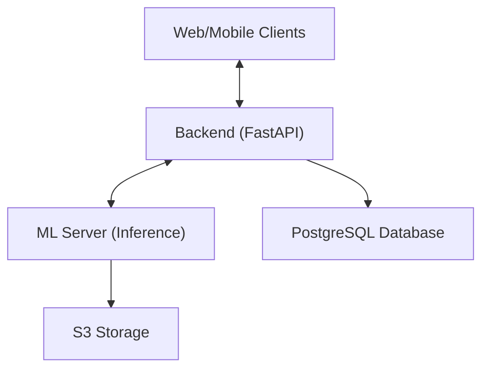

- **Web/Mobile Clients:** User interfaces for real-time translation and interaction.
- **Backend (FastAPI):** API gateway, authentication, business logic.
- **ML Server:** Handles model inference for sign recognition and translation.
- **PostgreSQL:** Stores user data, logs, and analytics.
- **S3 Storage:** Stores ML models and large assets.

---

### Component Diagram
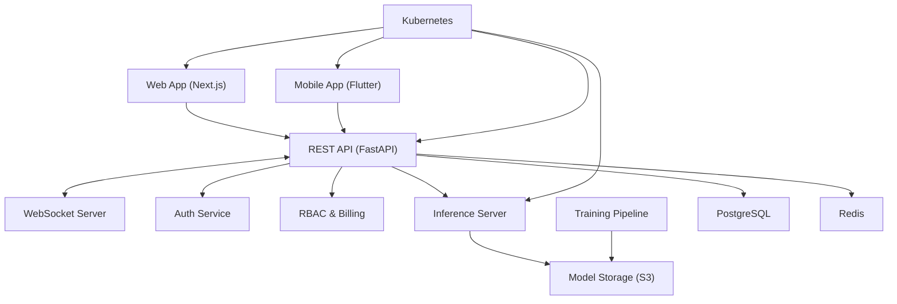

---

### Class Diagram (Core Example)
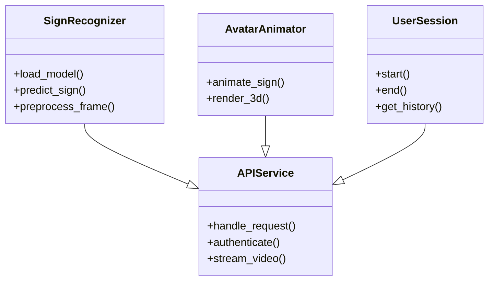

---

### Activity Diagram (Real-Time Translation)
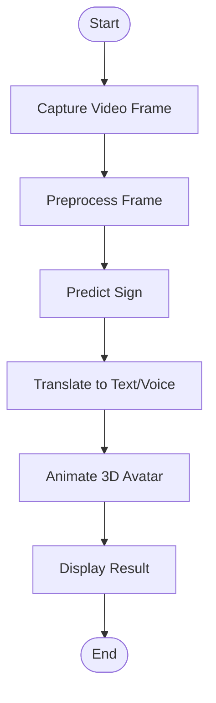

---

### State Diagram (Session State)
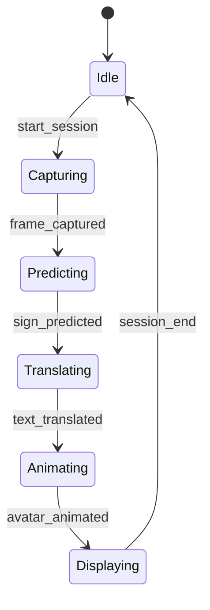

---

## Project Structure
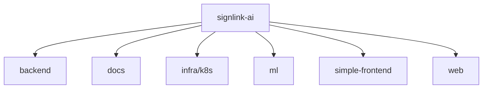

---

## Additional Mermaid Diagrams

### 1. API Request Flow
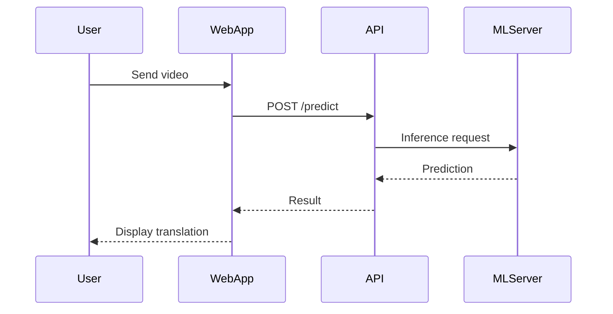

### 2. ML Training Pipeline
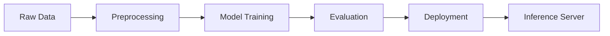

### 3. User Authentication Flow
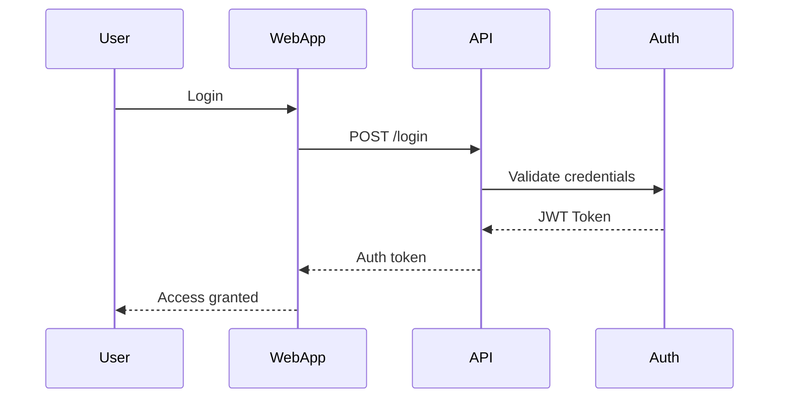

### 4. WebSocket Communication
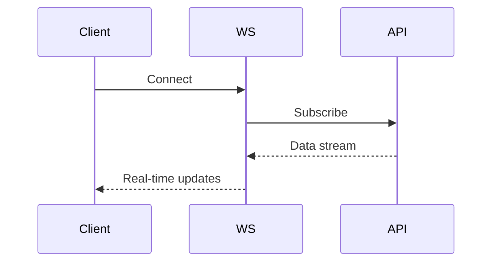

### 5. RBAC Permission Check
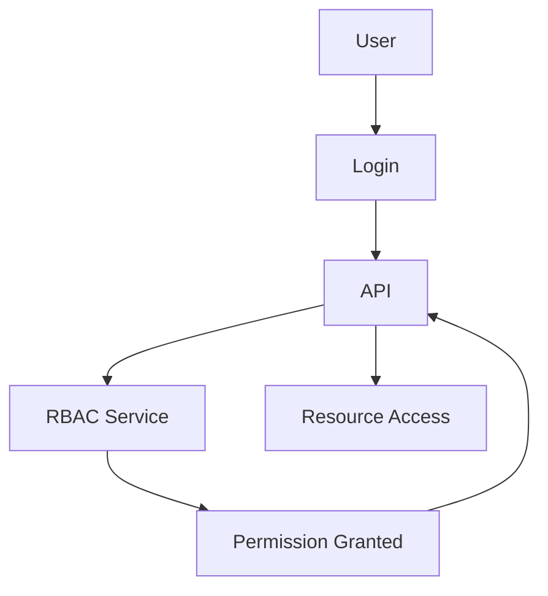

### 6. Data Encryption Flow
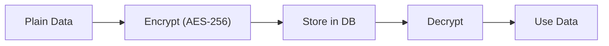

### 7. Avatar Animation Pipeline
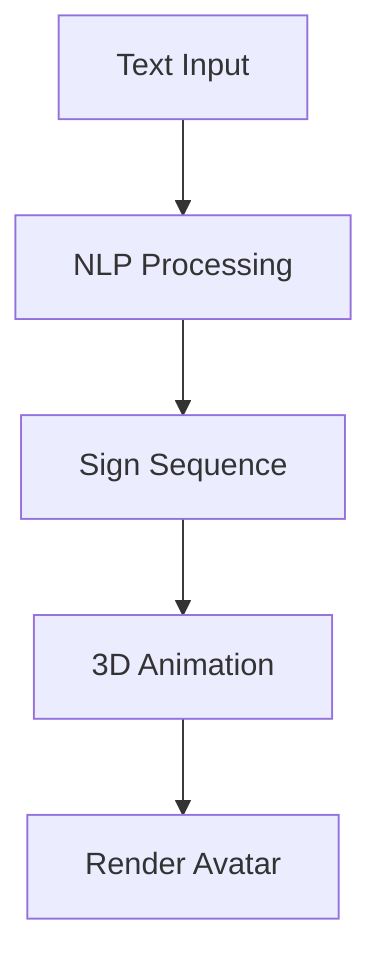

### 8. Offline Inference (Mobile)
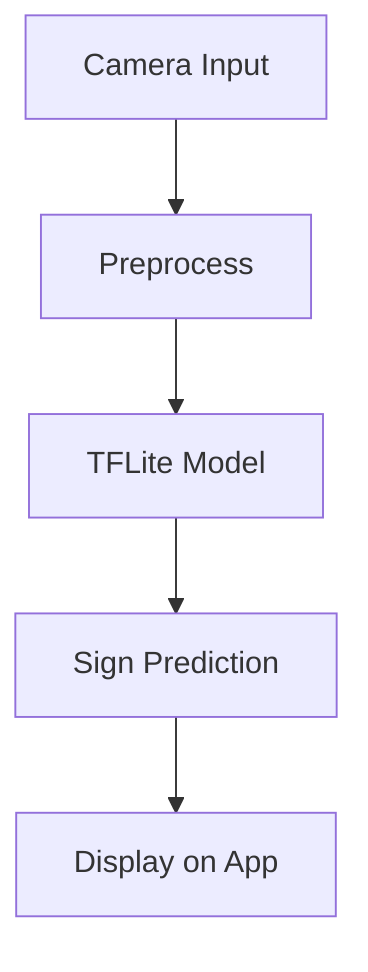

### 9. Monitoring & Logging
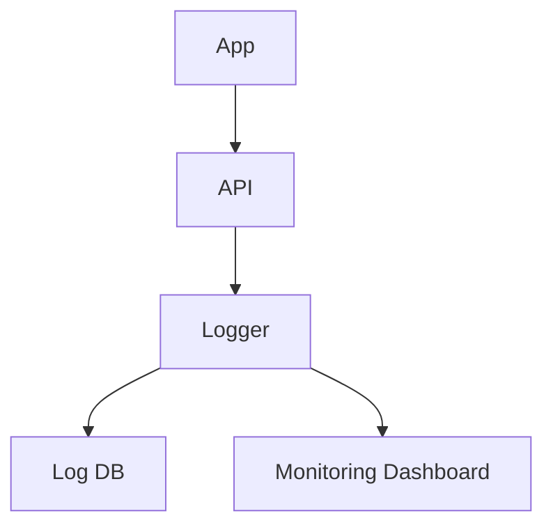

### 10. Multi-Tenancy Structure
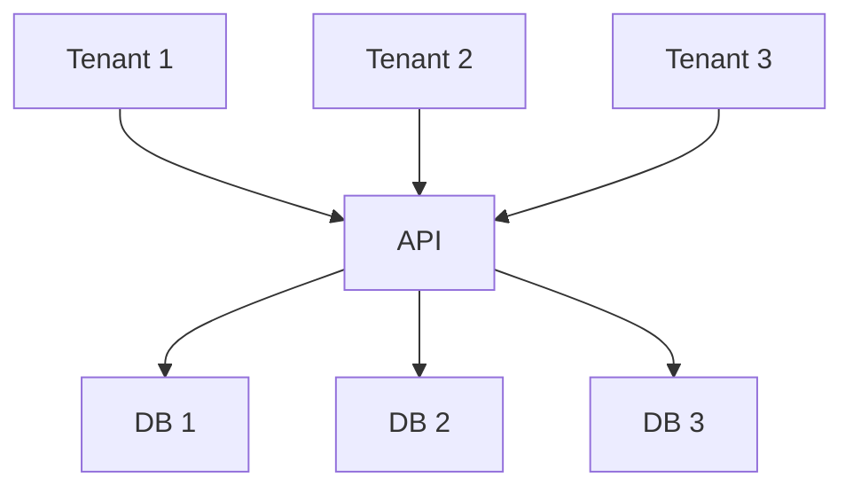

---

## Installation & Setup

### Quick Start (Real-Time Translation)

```bash
pip install opencv-python mediapipe pyttsx3 numpy
python simple_realtime_demo.py
```

### Full Platform with Docker

```bash
git clone https://github.com/Tanushreea05/signlink-ai.git
cd signlink-ai
docker-compose up --build
```

- Backend API: http://localhost:8000
- Web App: http://localhost:3000
- ML Server: http://localhost:8001

---

## Security & Best Practices

- JWT-based authentication with refresh tokens
- Role-based access control (RBAC)
- Data encryption at rest (AES-256) and in transit (TLS 1.3)
- Rate limiting and DDoS protection
- GDPR compliant data handling
- Regular security audits

---

## Testing

- Backend: `cd backend && pytest tests/ -v --cov=app`
- Frontend: `cd web && npm test`
- ML: `cd ml && pytest tests/ -v`
- Integration: `pytest tests/integration/ -v`

---

## Contribution Guidelines

- Fork the repository
- Create a feature branch (`git checkout -b feature/amazing-feature`)
- Commit your changes (`git commit -m 'Add amazing feature'`)
- Push to the branch (`git push origin feature/amazing-feature`)
- Open a Pull Request

See [CONTRIBUTING.md](docs/CONTRIBUTING.md) for details.

---

## License

This project is licensed under the MIT License. See the [LICENSE](LICENSE) file for details.

---

## Contact

- Website: [https://signlink.ai](https://signlink.ai/)
- Email: [support@signlink.ai](mailto:support@signlink.ai)
- Twitter: [@SignLinkAI](https://twitter.com/SignLinkAI)
- Discord: [Join our community](https://discord.gg/signlink-ai)

---

## Acknowledgments

- MediaPipe for hand tracking
- PyTorch team for the ML framework
- Sign language communities for feedback and validation

---
